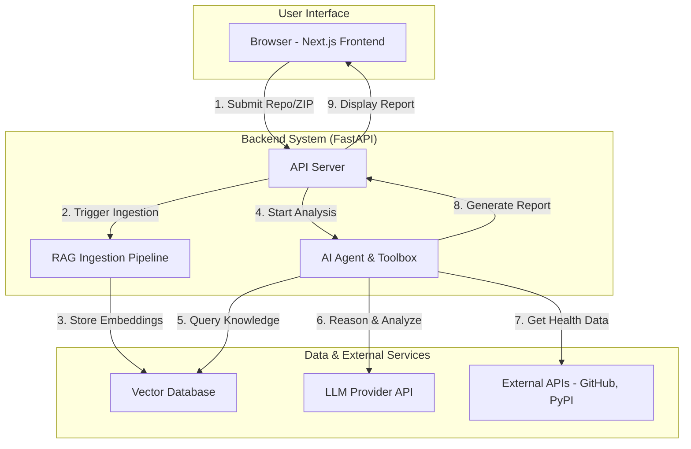

# System Architecture & Planning

This document provides a detailed overview of the system architecture, component relationships, data flow, and API structure for the AI-Powered Intelligent Code Reviewer.

---

## 1. High-level System Design and Component Relationships

The system is designed as a modern web application with a clear separation between the user interface, the backend processing, and the AI core.

-   **Frontend:** A Next.js single-page application that provides the user interface for submitting a repository URL or uploading a project folder. It is responsible for displaying the final analysis report.
-   **Backend (API Server):** A FastAPI application that serves as the main orchestrator. It handles user requests, manages the analysis pipeline, and serves the final report.
-   **RAG Pipeline:** A series of data processing steps responsible for ingesting the user's code and transforming it into a searchable knowledge base.
-   **AI Agent:** The core intelligence of the system. It uses the knowledge base from the RAG pipeline and a suite of tools to perform a deep analysis of the code.
-   **Vector Database:** A specialized database (initially ChromaDB) that stores the vector embeddings of the code chunks, enabling semantic search.

### Component Interaction Diagram



---

## 2. How RAG and AI Agent Functionality Will Work Together

The RAG pipeline and the AI Agent work in a symbiotic, two-phase process:

1.  **Phase 1: Knowledge Creation (RAG)**
    The RAG pipeline's sole purpose is to create a high-quality, searchable knowledge base from the user's code. It does this by chunking the code intelligently (using a language-aware `CodeSplitter`) and converting these chunks into vector embeddings. This process gives our system a deep, semantic "understanding" of the codebase.

2.  **Phase 2: Intelligent Analysis (AI Agent)**
    The AI Agent then uses this knowledge base to perform its analysis. It is not just a simple LLM call; it's an autonomous process that uses a "toolbox" to gather evidence before making a conclusion. The synergy is critical:
    -   The Agent uses its `semantic_code_search` tool to **query the RAG knowledge base** to find relevant pieces of code based on concepts, not just keywords (e.g., finding all authentication-related code).
    -   The Agent then uses its other tools (like `get_code_metrics` or external API calls) to **gather objective facts** about that code.
    -   Finally, the Agent uses an LLM to **reason over the combined evidence** (the semantic context from RAG + the factual data from its tools) to generate a high-quality, intelligent insight.

---

### Agent's Toolbox (Definitive List)

The agent has access to a set of specialized, well-defined tools to gather evidence.

-   **Tool 1: `query_codebase(semantic_query: str)`**: The primary RAG tool. Performs a semantic search over the vectorized codebase to find code based on concepts, not just keywords.
-   **Tool 2: `get_code_metrics(file_path: str, entity_name: str)`**: Calculates objective code metrics (e.g., Cyclomatic Complexity, line count) for a specific class or function using static analysis libraries.
-   **Tool 3: `read_file_contents(file_path: str)`**: Reads the entire raw text of a given source file for full context.
-   **Tool 4: `list_project_files()`**: Returns a tree-like structure of the project's file directory, giving the agent a high-level overview.
-   **Tool 5: `run_dependency_health_check()`**: Executes a comprehensive dependency analysis, combining CVE scan results with real-time health data (maintenance status, last commit date) gathered from external APIs (GitHub, PyPI, npm).
-   **Tool 6: `build_dependency_graph()`**: Parses all source files to map the import relationships between them, used specifically to detect circular dependencies.
-   **Tool 7: `scan_for_secrets()`**: Scans the codebase for patterns resembling hardcoded secrets using regex and entropy analysis.

### Agent Memory & Interaction Strategy (The Reasoning Loop)

While the overall system is stateless per user request, the agent itself requires **short-term working memory** to execute a multi-step analysis. This is managed by the agent framework (e.g., LangChain).

1.  **History as Context:** For each step in the analysis, the agent is provided with the full history of its previous `(thought, action, observation)` steps for the current job.
2.  **Chain of Thought:** This scratchpad of its own reasoning allows the agent to build on previous findings, correct its course, and gather sufficient evidence before making a final conclusion.
3.  **Logging for Observability:** Every step in this reasoning loop is recorded in our `agent_logs` database table, providing full transparency into the agent's decision-making process.

---

### Agent's Playbooks (Strategies)

The agent follows predefined strategies to analyze the codebase. The exhaustive, step-by-step logic for each playbook is detailed in the **[AI Agent Playbooks](./agent_playbooks.md)** document.

---

## 3. Detailed Database Schema and Data Flow

We will use a **SQLite database** to provide robust job tracking and detailed logging, replacing the simpler in-memory approach.

### Database Schema

The database will consist of three tables to manage the lifecycle and output of each analysis task.

1.  **`analysis_jobs` Table:** Tracks the high-level status of each task.
    -   `task_id` (TEXT, PRIMARY KEY)
    -   `status` (TEXT) - e.g., `PENDING`, `PROCESSING_RAG`, `PROCESSING_AGENT`, `COMPLETE`, `FAILED`
    -   `input_source_type` (TEXT) - e.g., 'git_url', 'zip_upload'
    -   `input_source_path` (TEXT)
    -   `created_at` (DATETIME)
    -   `completed_at` (DATETIME, NULLABLE)

2.  **`agent_logs` Table:** Provides a complete, auditable record of the agent's reasoning process for each job.
    -   `log_id` (INTEGER, PRIMARY KEY AUTOINCREMENT)
    -   `task_id` (TEXT, FOREIGN KEY to `analysis_jobs`)
    -   `step_index` (INTEGER) - The sequence number of the step (1, 2, 3...).
    -   `thought` (TEXT) - The agent's reasoning for its next action.
    -   `action_tool` (TEXT) - The name of the tool used.
    -   `action_input` (TEXT) - The specific input given to the tool.
    -   `observation` (TEXT) - The result returned from the tool.

3.  **`final_reports` Table:** Stores the final, user-facing report.
    -   `report_id` (INTEGER, PRIMARY KEY AUTOINCREMENT)
    -   `task_id` (TEXT, FOREIGN KEY to `analysis_jobs`)
    -   `report_content` (JSON) - The structured JSON output from the agent.

### End-to-End Data Flow

The system processes each analysis request in a distinct, multi-phase background job.

1.  **Phase 1: Task Initiation**
    -   A user request hits a `POST /api/analyze/...` endpoint.
    -   The backend saves the input, generates a unique `task_id`, and creates a new record in the **`analysis_jobs` table** with a `PENDING` status.
    -   A background task is spawned for the analysis.
    -   The API instantly returns the `task_id`.

2.  **Phase 2: RAG Pipeline Execution**
    -   The background task, managed by an `AnalysisManager`, updates the job status to `PROCESSING_RAG`.
    -   It extracts the source code into a temporary directory.
    -   It uses a language-aware `CodeSplitter` to chunk all source files and attaches rich metadata to each chunk.
    -   It initializes a new, isolated collection in our **Vector Database** (ChromaDB) named after the `task_id`.
    -   It converts all code chunks to vectors and stores them in the task-specific collection.

3.  **Phase 3: AI Agent Analysis**
    -   The job status in `analysis_jobs` is updated to `PROCESSING_AGENT`.
    -   The `AnalysisManager` assembles the agent's full toolbox.
    -   The agent is invoked and begins its reasoning loop. For each step, a new row is inserted into the **`agent_logs` table**.

4.  **Phase 4: Finalization & Cleanup**
    -   The agent returns a final JSON report, which is saved to the **`final_reports` table**.
    -   The `analysis_jobs` record is updated to `COMPLETE` with a `completed_at` timestamp.
    -   Crucially, the manager cleans up temporary files (source code directory and the ChromaDB collection). The SQLite database records are preserved for auditing and potential future use.

### Database & Data Store Schema (MVP)

Our data architecture uses two distinct databases for two different purposes:

-   **SQLite Database:**
    -   **Purpose:** To provide persistent, structured storage for job tracking and detailed agent logging.
    -   **Schema:** Defined by the `analysis_jobs`, `agent_logs`, and `final_reports` tables above.
    -   **Lifecycle:** Data is written throughout the analysis process and is preserved after completion for auditing and observability.

-   **Vector Database (ChromaDB):**
    -   **Purpose:** The ephemeral, high-performance knowledge base for a single analysis.
    -   **Structure:** We create one isolated **collection** per `task_id`. This collection holds the vectorized code chunks.
    -   **Metadata Schema:** Each vector is stored with a critical metadata payload:
        ```json
        {
          "file_path": "string",
          "language": "string",
          "start_line": "integer",
          "end_line": "integer",
          "chunk_type": "string", // e.g., 'class', 'function'
          "parent_context": "string", // e.g., 'Class: MyController'
          "chunk_code": "string"
        }
        ```
    -   **Lifecycle:** The collection is created when the RAG pipeline begins and is destroyed when the analysis ends.

---

## 4. Detailed API Structure and Integration Points

The API is designed to be asynchronous to handle long-running analysis tasks without blocking.

### API Endpoints

-   `POST /api/analyze/url`
    -   **Payload:** `{ "git_url": "..." }`
    -   **Action:** Validates input, creates a background analysis task, and returns a `task_id`.

-   `POST /api/analyze/zip`
    -   **Payload:** Multipart form data with a `.zip` file.
    -   **Action:** Saves the file, creates a background analysis task, and returns a `task_id`.

-   `GET /api/report/{task_id}`
    -   **Action:** The frontend polls this endpoint.
    -   **Response:** Returns the current job status (`PENDING`, `PROCESSING_RAG`, `PROCESSING_AGENT`, `COMPLETE`, `FAILED`). If complete, the response body includes the full JSON analysis report. 